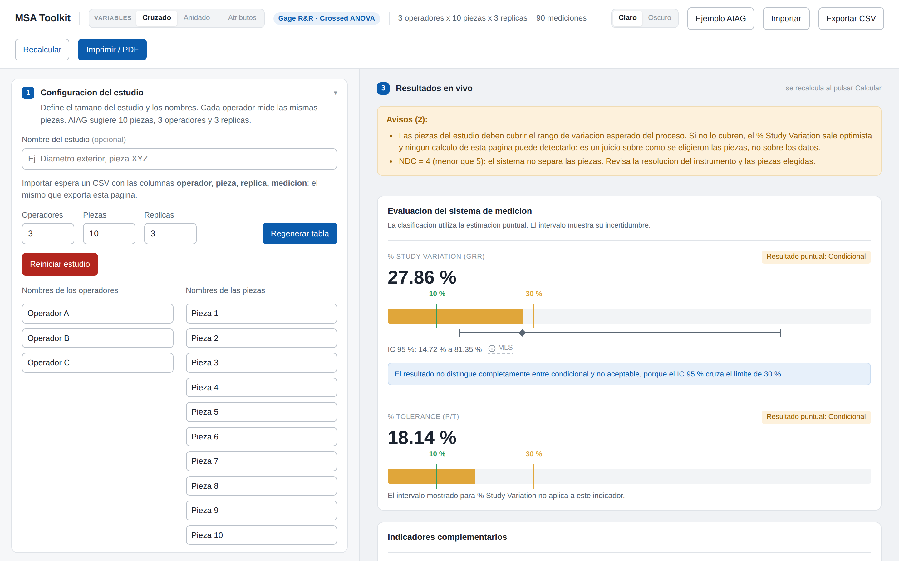

[](https://dflores296.github.io/msa-toolkit/)

[](https://github.com/dflores296/msa-toolkit/actions/workflows/ci.yml)


# MSA Toolkit

Estudios de **análisis de sistemas de medición (MSA)** que corren enteros en el
navegador. Sin instalar nada, sin servidor y sin licencia que pagar: se abre la
página, se capturan las mediciones y sale el estudio listo para imprimir.

**[Abrir la herramienta →](https://dflores296.github.io/msa-toolkit/)**

> **No sustituye el criterio de quien firma el estudio.** El motor está validado
> contra el dataset publicado del manual AIAG MSA 4.ª ed., pero aprobar o
> rechazar un sistema de medición es una decisión de ingeniería, no un número
> que devuelva una página.

## Para qué sirve

Reemplaza el libro de Excel con macros que se usaba para los Gage R&R, con el
motor de cálculo corregido: el original tenía
[12 defectos](docs/auditoria-motor-excel.md) en la tabla ANOVA, y cuatro de
ellos podían cambiar el veredicto.

| Método | Cuándo se usa | Qué devuelve |
|---|---|---|
| **Gage R&R cruzado** (*crossed*) | Medición normal: cada operador mide **las mismas** piezas | Tabla ANOVA, componentes de varianza, %GRR, NDC y ocho gráficas |
| **Gage R&R anidado** (*nested*) | **Pruebas destructivas**: medir la pieza la destruye, así que cada operador mide las suyas | Lo mismo, con cinco gráficas. Avisa en pantalla de que el diseño no puede separar la interacción operador × pieza |
| **Attribute Agreement** | Inspección **pasa / no pasa**: la medición es una categoría, no un número | Acuerdo, kappa, efectividad, error de fuga y falsa alarma. Aquí no hay varianza que descomponer, así que no salen %GRR ni NDC |

Se cambia de método desde el selector de la barra, y cada uno tiene su dirección
(`#cruzado`, `#anidado`, `#atributos`). **Cambiar de método vacía la captura**,
entre cualesquiera dos: la rejilla se ve igual en los tres, pero el mismo dato en
la misma celda significa otra cosa en cada uno, así que conservarlo daría un
estudio que parece válido y no lo es. Se pregunta antes, y cancelar no toca nada.

## Cómo se usa

1. **Configuración** — número de operadores, piezas y réplicas, con nombres
   editables.
2. **Captura** — se genera la tabla; escribes las mediciones o pegas un bloque
   copiado de Excel directamente en la primera celda.
3. **Resultados** — tabla ANOVA, componentes de varianza, evaluación del sistema
   de medición y las gráficas. Los límites de especificación son opcionales.

En **atributos** los tres pasos son los mismos, pero la celda es una categoría y
no un número, hay una columna de **estándar** —la clasificación correcta de cada
pieza, opcional— y los resultados son concordancias y kappa. Sin estándar solo
se puede saber si los evaluadores coinciden; pueden estar todos de acuerdo y
todos equivocados, y la página lo dice.

Los datos se pueden exportar e importar como CSV o JSON, y la vista de
resultados está preparada para imprimir a PDF.

## Validación

El motor cruzado se compara contra el dataset del apéndice del manual **AIAG MSA
4.ª ed.** (10 piezas × 3 operadores × 3 réplicas), el mismo que Minitab
distribuye como `gageaiag.mtw`:

| Cantidad | MSA Toolkit | Minitab publicado |
|---|---|---|
| SC Parte / Operador / Interacción / Repetibilidad | 88.3619 / 3.1673 / 0.3590 / 2.7589 | idem |
| F interacción, p | 0.434, 0.9741 | 0.434, 0.974 |
| % Contribución Gage R&R | 7.76 % | 7.76 % |
| % Study Variation Gage R&R | 27.86 % | 27.86 % |
| NDC | 4 | 4 |

El anidado y el de atributos no tienen todavía un dataset publicado de
referencia, y **no** se validan contra números inventados: se anclan en
identidades exactas del ANOVA y de kappa, y en casos resueltos a mano. El
detalle de los tres, en [`docs/motores.md`](docs/motores.md).

Las pruebas se corren con:

```bash
node tests/run-node.js
```

o abriendo [`tests/index.html`](https://dflores296.github.io/msa-toolkit/tests/)
en el navegador, que además muestra lado a lado los resultados del motor
corregido y los del motor VBA original.

## Estructura

| Ruta | Contenido |
|---|---|
| `index.html` | La aplicación, en una sola página |
| `assets/js/` | Los motores de cálculo (puros, sin DOM) y la interfaz |
| `assets/vendor/` | Chart.js, servido desde el propio repositorio |
| `datasets/` | Casos de validación con resultados publicados |
| `tests/` | Suite de regresión y reimplementación del VBA original |
| `docs/` | Documentación, auditorías y estándar de diseño |

`assets/js/anova.js` no depende del DOM ni de ninguna librería: se puede
importar desde Node o desde otra herramienta tal cual.

## Documentación

`docs/` mezcla **referencia viva** con **informes fechados**, y leer un informe
superado como si fuera referencia es el error fácil.
**[`docs/README.md`](docs/README.md)** dice cuál es cuál. Los que más se
consultan:

- [`docs/motores.md`](docs/motores.md) — contra qué está validado cada motor
- [`docs/discriminacion-y-resolucion.md`](docs/discriminacion-y-resolucion.md) —
  qué significa un %GRR de 0 % y cómo se infiere el escalón de las lecturas
- [`docs/intervalo-de-confianza.md`](docs/intervalo-de-confianza.md) — el
  intervalo del %GRR: qué método lo calcula y por qué no dictamina
- [`docs/pruebas.md`](docs/pruebas.md) — qué cubre cada suite y qué **no** cubre
- [`docs/estandar-de-diseno.md`](docs/estandar-de-diseno.md) — el estándar de
  interfaz y de redacción. Cada método nuevo debe cumplirlo, o cambiarlo primero
- [`docs/despliegue.md`](docs/despliegue.md) — publicar en GitHub Pages
- [`docs/auditoria-2026-08-31.md`](docs/auditoria-2026-08-31.md) — auditoría
  crítica de los tres motores bajo el supuesto de que la aplicación aprueba o
  rechaza sistemas de medición en planta, con el estado de cada hallazgo

## Alcance

**El alcance planeado está cubierto.** Los tres métodos que se usan en planta
—mediciones normales, pruebas destructivas e inspección por atributos— están
hechos, cada uno con su suite de regresión.

Lo que se evaluó y se decidió **no** hacer, con su razón, está en
[`docs/plan-siguientes-metodos.md`](docs/plan-siguientes-metodos.md): Promedio y
Rango (X̄ & R), Estudio Tipo 1 (Cg / Cgk), linealidad y sesgo, estabilidad, y
Kendall para categorías ordenadas. Ninguno está descartado para siempre;
simplemente piden instrumentación o patrones que rara vez están disponibles.

## Licencia

**Código visible, no código abierto.** Copyright (c) 2026 dflores296, todos los
derechos reservados. El repositorio es público para poder consultarlo y para
alojar el sitio en GitHub Pages, pero **no** se concede licencia de uso, copia,
modificación ni redistribución. Ver [LICENSE](LICENSE).

Chart.js (`assets/vendor/`) mantiene su licencia MIT propia.

## Marcas

Minitab es marca registrada de Minitab, LLC. AIAG es marca registrada de
Automotive Industry Action Group. Este proyecto no está afiliado ni avalado por
ellos. Se les menciona únicamente como referencia técnica: para citar la
convención de cálculo que sigue cada quien y para documentar contra qué valores
publicados se validó el motor.
