# Propuesta de rediseño: Seline (claro) + Dovetail (oscuro)

> **Propuesta, no estado actual.** La aplicación publicada sigue la hoja de
> siempre y el contrato vigente es [`estandar-de-diseno.md`](estandar-de-diseno.md).
> Esta propuesta se puede **ver funcionando** en
> [`propuesta/`](../propuesta/) — la misma app, el mismo motor y el mismo
> HTML, con una hoja de estilo encima — y compararla con la versión actual.

Fecha: 3 de octubre de 2026. Versión 2: sustituye a una primera propuesta
(serif editorial sobre papel, estilo Steep) que se descartó.

## Referencias

| Referencia | Qué se toma |
|---|---|
| **Seline** | El tema **claro**: lienzo de piedra cálido `#fafaf9`, tarjetas blancas cuya estructura es el borde fino `#e8e6e5`, un solo acento cian `#3ba6f1` en la acción principal, botones píldora, un resaltado por titular |
| **Dovetail** | El tema **oscuro**: casi negro `#0a0a0a`, tarjetas `#1e1e1e` sin sombra, esquinas de 8 px, primaria blanca, azul `#6798ff` solo como acento, rótulos en JetBrains Mono y la rejilla de fondo |
| **Basedash** | Apoyo del oscuro: la primaria blanca como el objeto más brillante de la pantalla, y el violeta y la menta como colores de serie en las gráficas |
| **Skill ui-ux-pro-max** | La lista de entrega usada como criterio de aceptación: contraste ≥ 4.5:1, foco visible, `prefers-reduced-motion`, iconos SVG, responsive a 375 / 768 / 1024 / 1440 px |

Tipografía: **solo Inter y JetBrains Mono**, sin serif.

## Colores que no cambian

**Requisito técnico, en los dos temas.** La propuesta no toca:

- **El semáforo de las gráficas de resumen**: las barras de evaluación
  (`.eval-fill`), las marcas de umbral de 10 % / 30 % y 80 % / 90 %
  (`.eval-tick`), las pastillas Aceptable / Condicional / No aceptable (`.t.*`)
  y los tokens `--sem-ok #2e9e63`, `--sem-warn #e0a63a` y `--sem-bad #d1453b`.
- **La gráfica de Componentes de variación**: azul `#0b5cad` (% Contribución),
  rojo `#b3261e` (% Study Variation) y ámbar `--sem-warn` (% Tolerance), con
  sus umbrales verde y ámbar.

Para que eso no dependa de la hoja de estilo, `charts.js` fija esos dos
colores en `COMPONENT_COLORS` y la gráfica 1 ya no los lee de la paleta del
tema. Verificado con Playwright en producción y en la maqueta, claro y
oscuro: las tres barras salen `#0b5cad`, `#b3261e` y `#e0a63a`, y los rellenos
y umbrales del semáforo, idénticos a los de producción.

El resto de las gráficas (cartas R y X-barra, cajas, rangos, interacción,
atributos) sí siguen al estilo.

## Antes y después

| Antes | Después |
|---|---|
| 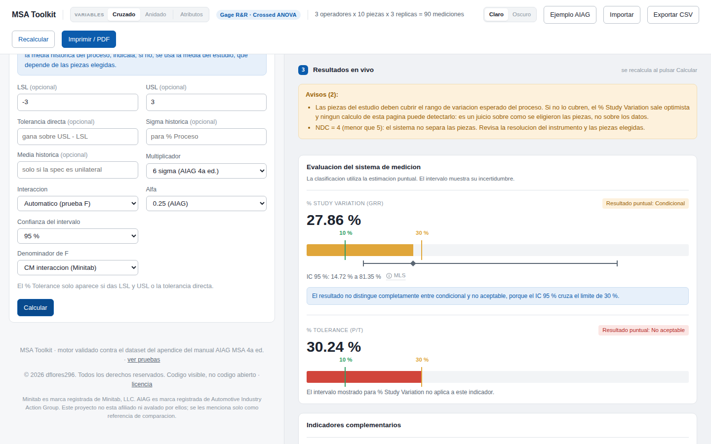 | 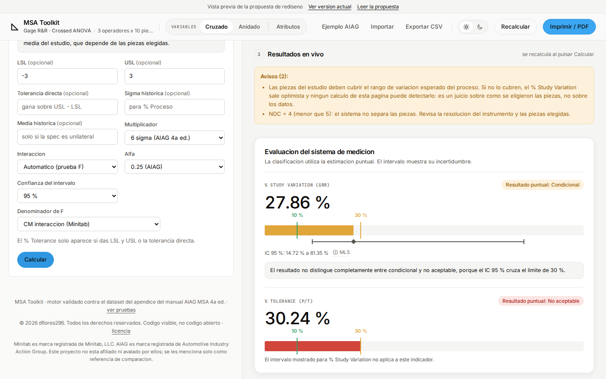 |
| 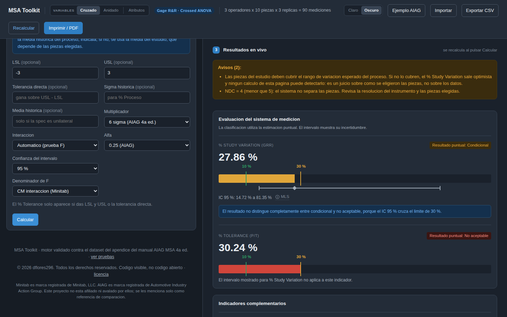 | 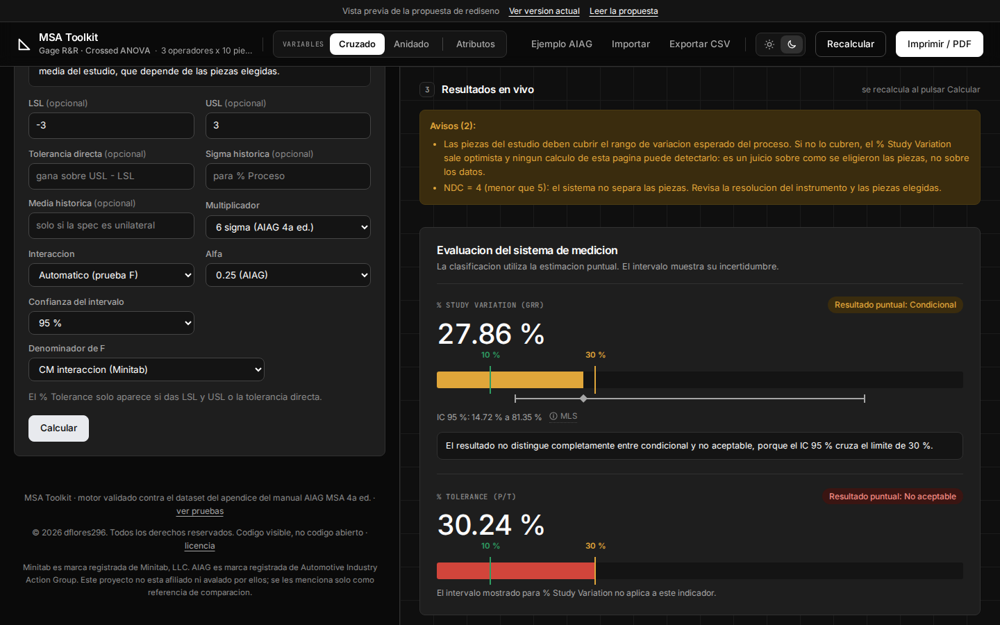 |
| 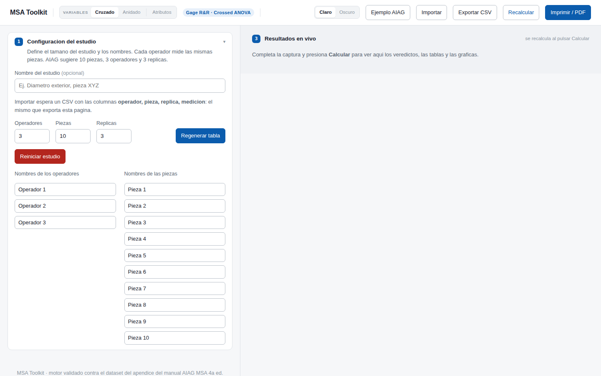 | 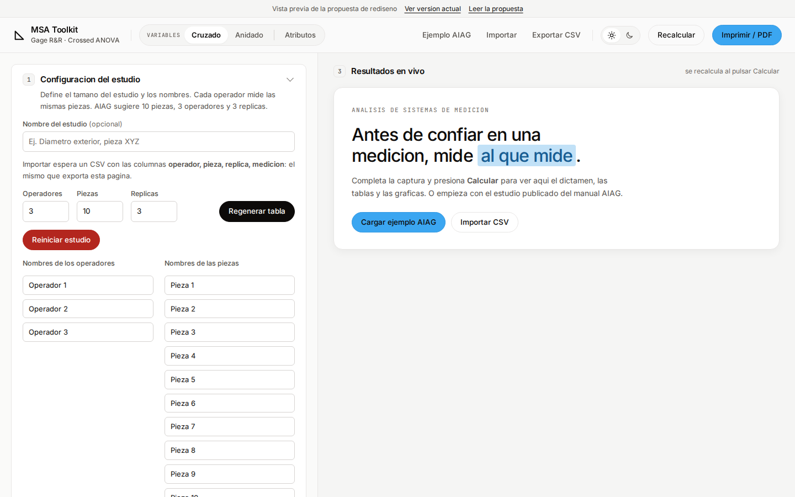 |
| 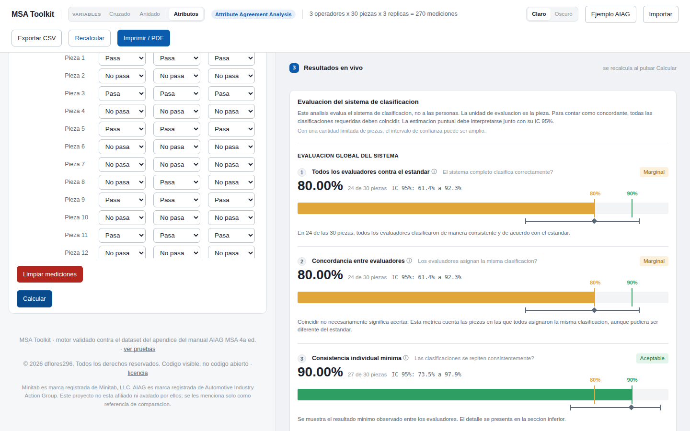 | 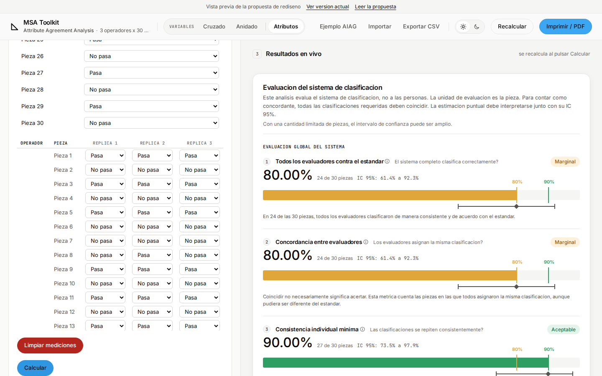 |
| 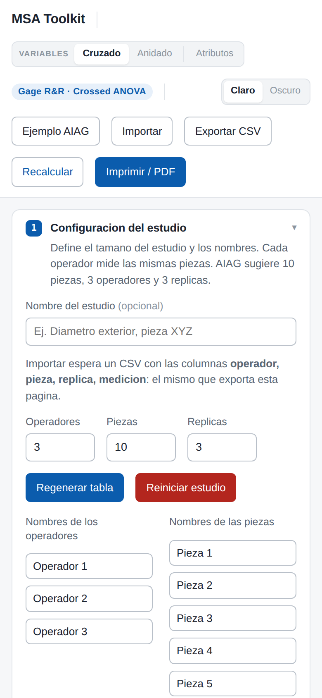 | 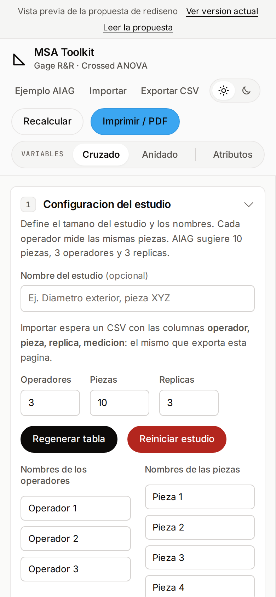 |

Atributos en oscuro:

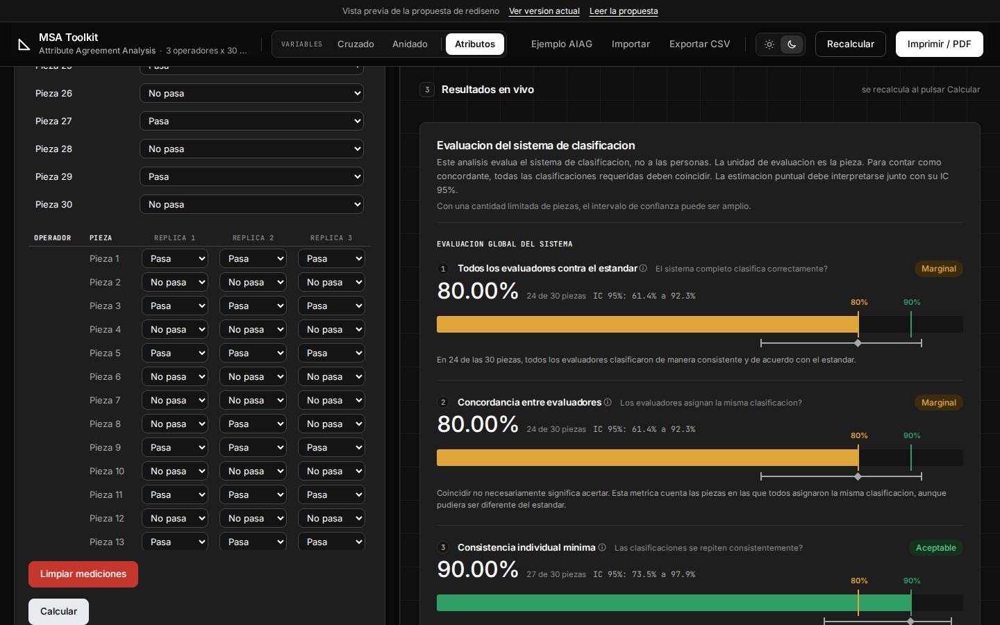

Reporte impreso (portada, dictamen y gráficas):

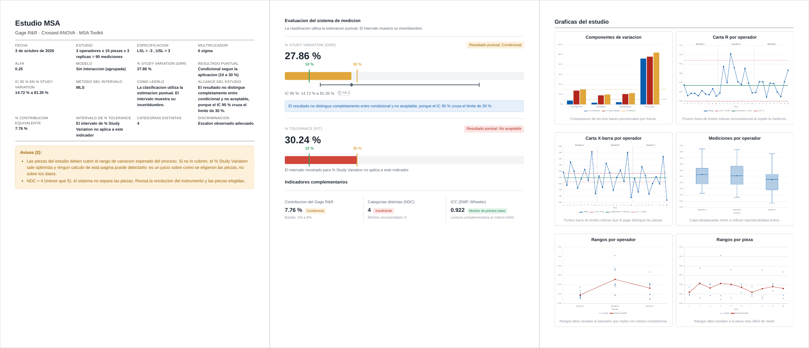
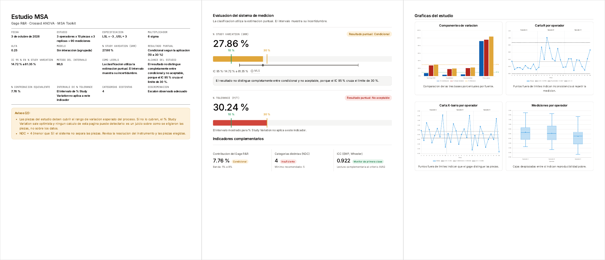

Capturas con el ejemplo AIAG (en cruzado con LSL = −3 y USL = 3) a
1440 × 900, salvo la de teléfono (390 px).

## Sistema

### Color

| Rol | Hoy | Claro (Seline) | Oscuro (Dovetail) |
|---|---|---|---|
| Lienzo | `#f6f7f9` / `#161c24` | `#fafaf9` | `#0a0a0a` |
| Banda de resultados | `#f0f2f5` / `#1a212b` | `#f5f5f4` | `#0f0f0f` + rejilla de 48 px |
| Tarjeta | blanca + borde | `#ffffff` + `#e8e6e5` | `#1e1e1e` + `#313131` |
| Borde de campo | `#b9c0c9` | `#d6d3d1` | `#454545` |
| Tinta / suave / tenue | `#1c2430` / `#5a6673` / `#8b959f` | `#0c0a09` / `#57534e` / `#6f6964` | `#ffffff` / `#a7a7a7` / `#8a8a8a` |
| Acción primaria | azul `#0b5cad`, texto blanco | **cian `#3ba6f1`, texto tinta** | **blanco, texto `#0a0a0a`** |
| Enlaces, pestaña activa, foco | azul | `#1f6fae` | `#6798ff` |
| Información e interpretación | azul claro | `#f5f5f4` con borde fino | `#141414` con borde fino |
| Avisos ámbar y rojo | — | sin cambio | sin cambio |

Contraste medido (WCAG, texto normal): tinta 18.9:1, suave 7.0:1 y tenue
5.0:1 sobre la banda clara; en oscuro 16.7, 6.9 y 4.8:1 sobre tarjeta; enlace
claro 5.3:1; azul de Dovetail 6.0:1 sobre tarjeta; resaltado del titular
5.1:1.

**Una desviación de Seline:** su botón cian lleva texto blanco, que da 2.6:1.
Aquí lleva tinta (7.4:1). Y, como pide Seline, el cian aparece una vez por
vista: «Regenerar tabla», que vive junto a Calcular, va en tinta.

### Tipografía

| Elemento | Hoy | Propuesta |
|---|---|---|
| Marca | 16 px / 700 | Inter 15 px / 600 + el triángulo del favicon |
| Títulos de paso y de tarjeta | 13.5 px / 600 | Inter 15–16 px / 600, tracking −0.02em |
| Rótulos de sección (`% STUDY VARIATION`, `EVALUACION GLOBAL`, encabezados de tabla, «Variables») | sans 11 px mayúsculas | **JetBrains Mono** 10–11 px mayúsculas, +0.07em |
| Cifra que decide | 30 px / 600 | Inter 40 px / 500 tabular, tracking −0.035em |
| Cifras de tablas, celdas de captura, intervalos | monoespaciada de sistema | JetBrains Mono |
| Cuerpo | 15 px | Inter 14 px |

Las dos fuentes van **autoalojadas** en `assets/fonts/` (≈ 90 kB, licencia
OFL en `assets/fonts/OFL.txt`): la app funciona sin conexión.

### Forma y elevación

| | Claro | Oscuro |
|---|---|---|
| Tarjetas | radio 10 px, borde fino | radio 8 px, borde `#313131` |
| Dictamen y estado vacío | radio 16 px, sombra `0 4px 16px rgba(0,0,0,.05)` | radio 8 px, sin sombra |
| Botones y selectores | píldora | radio 8 px |
| Campos | radio 6 px | radio 8 px |

### Componentes

- **Barra superior.** Marca con el triángulo del favicon y, debajo, el estudio
  citado y su tamaño. El selector de método al centro. Ejemplo AIAG, Importar
  y Exportar como botones de texto; el tema como iconos SVG de sol y luna; al
  final Recalcular (contorno) e Imprimir / PDF (primaria). **Un renglón desde
  1200 px**: lo que cede es la línea del estudio, con puntos suspensivos. Hoy
  se parte en dos incluso a 1440 px.
- **Pasos.** La insignia azul se sustituye por una casilla neutra con el
  número en mono.
- **Estado vacío.** Hoy es una línea gris. En la propuesta es una tarjeta con
  rótulo mono, un titular con **un** resaltado al estilo Seline («mide *al que
  mide*») y Cargar ejemplo AIAG + Importar CSV.
- **Tablas.** Filas separadas por borde fino, encabezados en mono y cifras en
  mono tabular.
- **Gráficas (salvo Componentes).** Series en cian, tinta y piedra en claro;
  azul de Dovetail, blanco y gris en oscuro, con el violeta y la menta de
  Basedash como cuarta y quinta serie.
- **Teléfono.** Por debajo de 760 px la barra se desplaza con la página (hoy
  fija, ocupa 238 de 844 px) y el selector de método va al final.
- **Reporte impreso.** Papel blanco, sin bandas ni rejilla; títulos en Inter,
  metadatos en mono. Las reglas del §7 del estándar no cambian.

### Defectos de producción que la propuesta corrige

Aparecieron al revisar recortes (§2 del estándar: ningún texto de `<select>`
cortado), y existen hoy:

- A 1280 px las celdas de atributos muestran «No p…». La celda pide 86 px y
  la tabla se desplaza dentro de su `.table-scroll`.
- La opción «CM repetibilidad (ejemplo AIAG p.127)» del denominador de F no
  cabe a ningún ancho. El campo, solo en su fila, la ocupa entera.

Conviene llevarlos a `style.css` aunque el rediseño no se adopte.

## Lo que no cambia

- **Ningún número**: el motor, los datasets y las 230 pruebas son los mismos.
- **Los colores de la sección anterior.**
- **El carril del intervalo** y sus medidas enteras.
- **La estructura**: banco 40/60, pasos, tarjetas plegables, pestañas con
  Gráficas primero, `data-methods`, rejillas `auto-fill`.
- **La redacción**, salvo el estado vacío.
- **El orden y las reglas del reporte impreso.**

## Qué cambiaría en el estándar de diseño

| Sección | Cambio |
|---|---|
| §1 Pasos numerados | `.step` neutro con número en mono, sin relleno de color |
| §1 Espaciado | Radios por tema (tabla de forma) |
| §2 Bloque de resultado | Cifra que decide en Inter 40 px / 500; rótulos en mono |
| §3 Color | Tokens por tema; primaria cian / blanca; la gráfica de Componentes y el semáforo **fijos** en `charts.js` y `--sem-*` |
| §3 nuevo | Tipografía: Inter + JetBrains Mono autoalojadas |
| §4 Gráficas | Paleta de series vía `--chart-series`, salvo Componentes |

## Cómo está hecha la maqueta

| Archivo | Qué |
|---|---|
| [`assets/css/propuesta.css`](../assets/css/propuesta.css) | La propuesta entera: tokens de los dos temas y componentes. Solo la carga la maqueta |
| [`propuesta/index.html`](../propuesta/index.html) | **Generado** por `node tools/build-propuesta.js` desde `index.html`. Si `index.html` cambia y una sustitución deja de encontrar su texto, el script falla y dice cuál; CI corre `--check` |
| `assets/fonts/` | Inter y JetBrains Mono, woff2 latino |
| [`assets/js/charts.js`](../assets/js/charts.js) | Lee la paleta de `--chart-series` si la hoja la define, y fija `COMPONENT_COLORS`. En producción el dibujo es idéntico: `tests/regresion-visual.js` no encuentra diferencias en cruzado ni en anidado |

Abierta con doble clic (`file://`), Firefox no carga fuentes de una carpeta
superior y la maqueta usa las de sistema. Servida por GitHub Pages o un
servidor local se ve completa.

## Adopción por fases

1. **Tokens y tipografía** a `style.css`. Es el 80 % del cambio visible y no
   toca HTML.
2. **Barra y estado vacío** a `index.html`; menú «Archivo» en teléfono.
3. **Estándar**: reescribir las secciones de la tabla anterior, regenerar
   `docs/portada.png` y retirar la maqueta.

## Verificación hecha

- `node tests/run-node.js`: 230/230.
- `node tests/regresion-visual.js HEAD cruzado` y `… anidado`: sin
  diferencias en producción (atributos no se puede recorrer con esa
  herramienta: su guion llena campos de variables).
- Colores fijos leídos del lienzo de Chart.js y del CSS calculado, en
  producción y maqueta, claro y oscuro.
- Capturas de los tres métodos a 1440, 1280 y 390 px y reporte a PDF: sin
  desplazamiento horizontal, barra en un renglón (1280 y 1440 px) y sin
  errores de consola; ninguna opción de `<select>` ni rótulo recortado a 1280
  y 1440 px.
